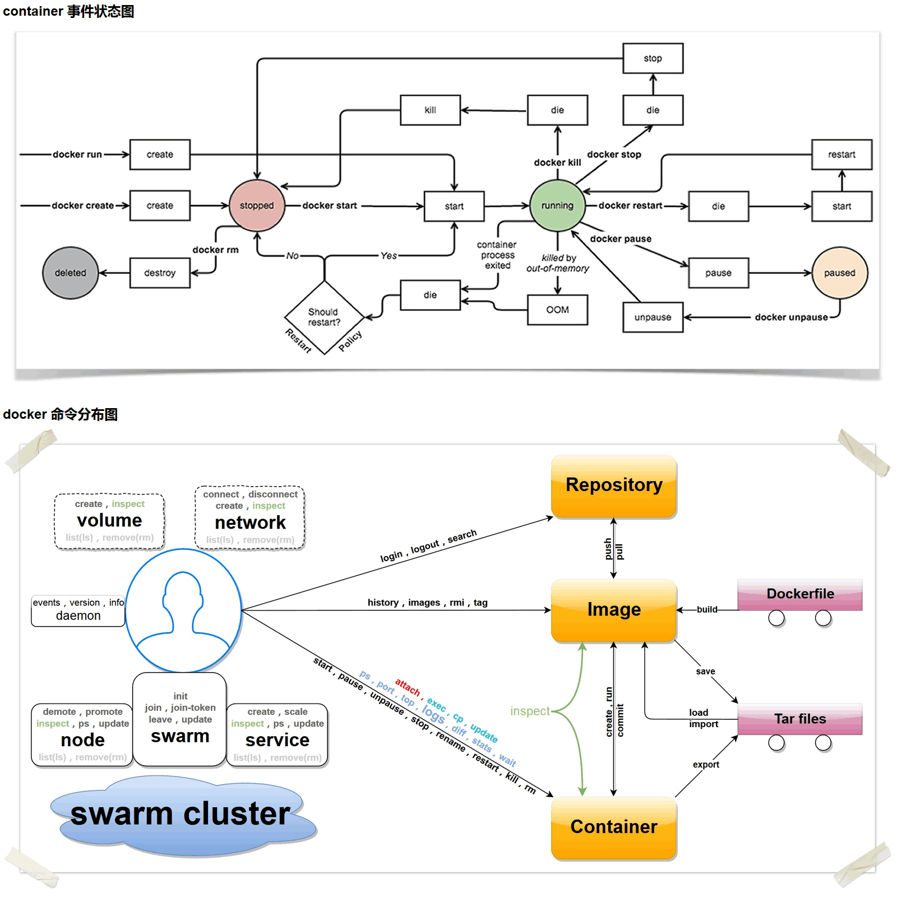

# Docker 命令查询

## 基本语法
Docker 命令有两大类，客户端命令和服务端命令。前者是主要的操作接口，后者用来启动 Docker daemon。

* 客户端命令：基本命令格式为 `docker [OPTIONS] COMMAND [arg...]`；
* 服务端命令：基本命令格式为 `docker daemon [OPTIONS]`。

可以通过 `man docker` 或 `docker help` 来查看这些命令。

## 客户端命令选项

* --config=""：指定客户端配置文件，默认为 `/.docker`；
* -D=true|false：是否使用 debug 模式。默认不开启；
* -H, --host=[]：指定命令对应 Docker daemon 的监听接口，可以为 unix 套接字（unix:///path/to/socket），文件句柄（fd://socketfd）或 tcp 套接字（tcp://[host[:port]]），默认为 unix:///var/run/docker.sock；
* -l, --log-level="debug|info|warn|error|fatal"：指定日志输出级别；
* --tls=true|false：是否对 Docker daemon 启用 TLS 安全机制，默认为否；
* --tlscacert= /.docker/ca.pem：TLS CA 签名的可信证书文件路径；
* --tlscert= /.docker/cert.pem：TLS 可信证书文件路径；
* --tlscert= /.docker/key.pem：TLS 密钥文件路径；
* --tlsverify=true|false：启用 TLS 校验，默认为否。

## daemon 命令选项
* --api-cors-header=""：CORS 头部域，默认不允许 CORS，要允许任意的跨域访问，可以指定为 “*”；
* --authorization-plugin=""：载入认证的插件；
* -b=""：将容器挂载到一个已存在的网桥上。指定为 'none' 时则禁用容器的网络，与 --bip 选项互斥；
* --bip=""：让动态创建的 docker0 网桥采用给定的 CIDR 地址; 与 -b 选项互斥；
* --cgroup-parent=""：指定 cgroup 的父组，默认 fs cgroup 驱动为 `/docker`，systemd cgroup 驱动为 `system.slice`；
* --cluster-store=""：构成集群（如 Swarm）时，集群键值数据库服务地址；
* --cluster-advertise=""：构成集群时，自身的被访问地址，可以为 `host:port` 或 `interface:port`；
* --cluster-store-opt=""：构成集群时，键值数据库的配置选项；
* --config-file="/etc/docker/daemon.json"：daemon 配置文件路径；
* --containerd=""：containerd 文件的路径；
* -D, --debug=true|false：是否使用 Debug 模式。缺省为 false；
* --default-gateway=""：容器的 IPv4 网关地址，必须在网桥的子网段内；
* --default-gateway-v6=""：容器的 IPv6 网关地址；
* --default-ulimit=[]：默认的 ulimit 值；
* --disable-legacy-registry=true|false：是否允许访问旧版本的镜像仓库服务器；
* --dns=""：指定容器使用的 DNS 服务器地址；
* --dns-opt=""：DNS 选项；
* --dns-search=[]：DNS 搜索域；
* --exec-opt=[]：运行时的执行选项；
* --exec-root=""：容器执行状态文件的根路径，默认为 `/var/run/docker`；
* --fixed-cidr=""：限定分配 IPv4 地址范围；
* --fixed-cidr-v6=""：限定分配 IPv6 地址范围；
* -G, --group=""：分配给 unix 套接字的组，默认为 `docker`；
* -g, --graph=""：Docker 运行时的根路径，默认为 `/var/lib/docker`；
* -H, --host=[]：指定命令对应 Docker daemon 的监听接口，可以为 unix 套接字（unix:///path/to/socket），文件句柄（fd://socketfd）或 tcp 套接字（tcp://[host[:port]]），默认为 unix:///var/run/docker.sock；
* --icc=true|false：是否启用容器间以及跟 daemon 所在主机的通信。默认为 true。
* --insecure-registry=[]：允许访问给定的非安全仓库服务；
* --ip=""：绑定容器端口时候的默认 IP 地址。缺省为 0.0.0.0；
* --ip-forward=true|false：是否检查启动在 Docker 主机上的启用 IP 转发服务，默认开启。注意关闭该选项将不对系统转发能力进行任何检查修改；
* --ip-masq=true|false：是否进行地址伪装，用于容器访问外部网络，默认开启；
* --iptables=true|false：是否允许 Docker 添加 iptables 规则。缺省为 true；
* --ipv6=true|false：是否启用 IPv6 支持，默认关闭；
* -l, --log-level="debug|info|warn|error|fatal"：指定日志输出级别；
* --label="[]"：添加指定的键值对标注；
* --log-driver="json-file|syslog|journald|gelf|fluentd|awslogs|splunk|etwlogs|gcplogs|none"：指定日志后端驱动，默认为 json-file；
* --log-opt=[]：日志后端的选项；
* --mtu=VALUE：指定容器网络的 mtu；
* -p=""：指定 daemon 的 PID 文件路径。缺省为 `/var/run/docker.pid`；
* --raw-logs：输出原始，未加色彩的日志信息；
* --registry-mirror=<scheme>://<host>：指定 `docker pull` 时使用的注册服务器镜像地址；
* -s, --storage-driver=""：指定使用给定的存储后端；
* --selinux-enabled=true|false：是否启用 SELinux 支持。缺省值为 false。SELinux 目前尚不支持 overlay 存储驱动；
* --storage-opt=[]：驱动后端选项；
* --tls=true|false：是否对 Docker daemon 启用 TLS 安全机制，默认为否；
* --tlscacert= /.docker/ca.pem：TLS CA 签名的可信证书文件路径；
* --tlscert= /.docker/cert.pem：TLS 可信证书文件路径；
* --tlscert= /.docker/key.pem：TLS 密钥文件路径；
* --tlsverify=true|false：启用 TLS 校验，默认为否；
* --userland-proxy=true|false：是否使用用户态代理来实现容器间和出容器的回环通信，默认为 true；
* --userns-remap=default|uid:gid|user:group|user|uid：指定容器的用户命名空间，默认是创建新的 UID 和 GID 映射到容器内进程。

## 客户端命令（子命令）

子命令分类：
- 容器生命周期管理：run、start/stop/restart、kill、rm、pause/unpause、create、exec
- 容器操作：ps、inspect、top、attach、events、logs、wait、export、port
- 容器rootfs命令：commit、cp、diff
- 镜像仓库：login、pull、push、search
- 本地镜像管理：images、rmi、tag、build、history、save、import
- 环境信息：info、version

可以通过 `man docker-COMMAND` 或 `docker help COMMAND` 来查看这些命令的具体用法。

* attach：依附到一个正在运行的容器中；
* build：从一个 Dockerfile 创建一个镜像；
* commit：从一个容器的修改中创建一个新的镜像；
* cp：在容器和本地宿主系统之间复制文件中；
* create：创建一个新容器，但并不运行它；
* diff：检查一个容器内文件系统的修改，包括修改和增加；
* events：从服务端获取实时的事件；
* exec：在运行的容器内执行命令；
* export：导出容器内容为一个 tar 包；
* history：显示一个镜像的历史信息；
* images：列出存在的镜像；
* import：导入一个文件（典型为 tar 包）路径或目录来创建一个本地镜像；
* info：显示一些相关的系统信息；
* inspect：显示一个容器的具体配置信息；
* kill：关闭一个运行中的容器 (包括进程和所有相关资源)；
* load：从一个 tar 包中加载一个镜像；
* login：注册或登录到一个 Docker 的仓库服务器；
* logout：从 Docker 的仓库服务器登出；
* logs：获取容器的 log 信息；
* network：管理 Docker 的网络，包括查看、创建、删除、挂载、卸载等；
* node：管理 swarm 集群中的节点，包括查看、更新、删除、提升/取消管理节点等；
* pause：暂停一个容器中的所有进程；
* port：查找一个 nat 到一个私有网口的公共口；
* ps：列出主机上的容器；
* pull：从一个Docker的仓库服务器下拉一个镜像或仓库；
* push：将一个镜像或者仓库推送到一个 Docker 的注册服务器；
* rename：重命名一个容器；
* restart：重启一个运行中的容器；
* rm：删除给定的若干个容器；
* rmi：删除给定的若干个镜像；
* run：创建一个新容器，并在其中运行给定命令；
* save：保存一个镜像为 tar 包文件；
* search：在 Docker index 中搜索一个镜像；
* service：管理 Docker 所启动的应用服务，包括创建、更新、删除等；
* start：启动一个容器；
* stats：输出（一个或多个）容器的资源使用统计信息；
* stop：终止一个运行中的容器；
* swarm：管理 Docker swarm 集群，包括创建、加入、退出、更新等；
* tag：为一个镜像打标签；
* top：查看一个容器中的正在运行的进程信息；
* unpause：将一个容器内所有的进程从暂停状态中恢复；
* update：更新指定的若干容器的配置信息；
* version：输出 Docker 的版本信息；
* volume：管理 Docker volume，包括查看、创建、删除等；
* wait：阻塞直到一个容器终止，然后输出它的退出符。

## 一张图总结 Docker 的命令

